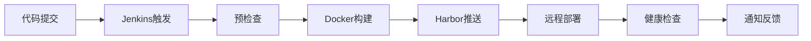

# CI/CD 项目技术文档

## 1. 项目概述

### 1.1 系统架构
本项目采用现代 DevOps/GitOps 架构，实现自动化部署流程。

### 1.2 技术栈
- **构建工具**: Jenkins Pipeline argocd
- **容器技术**: Docker
- **制品仓库**: Harbor
- **版本控制**: Git
- **通知系统**: 支持Webhook协议或其他IM平替啊
- **部署方式**: SSH Remote Deploy/argocd监听

## 2. 部署架构

### 2.1 部署流程
#### 2.1.1 DevOps模式


#### 2.1.2 GitOps模式
```mermaid
graph LR
    A[代码提交] --> B[Jenkins触发]
    B --> C[预检查]
    C --> D[Docker构建]
    D --> E[Harbor推送]
    E --> F[更新资源清单仓库]

    上下没有关联性 手动也可以维护资源清单仓库进行版本变更与回滚

    F --> G[argocd轮询资源仓库变化进行一致性同步]
    G --> H[同步成功/通知反馈]
```

## 3. 配置说明

### 3.1 Jenkins 凭证配置
需要在 Jenkins 中配置以下凭证：
1. `harbor-credentials`: Harbor 登录凭证
2. `ssh-credentials`: SSH 密钥
3. `feishu-webhook`: 飞书 Webhook URL
4. `harbor-host`: Harbor 仓库地址
5. `deploy-hosts`: 部署服务器地址


## 4. 部署流程

### 4.1 预检查阶段
- 检查必要参数完整性
- 验证环境变量配置

### 4.2 部署阶段
1. Harbor 登录认证
2. 拉取目标镜像
3. 优雅停止旧容器
4. 启动新容器
5. 健康检查验证

### 4.3 回滚机制
- 触发条件：部署失败或健康检查失败
- 回滚操作：重启备份容器
- 错误通知：发送失败告警


## 5. 监控告警

### 5.1 健康检查
- 检查端点: `/health`
- 超时时间: 5秒
- 重试机制: 循环检测

### 5.2 通知机制
状态通知卡片包含：
- 部署状态
- 提交者信息
- 构建编号
- 提交信息
- 部署版本
- 详情链接

## 6. 安全规范

### 6.1 凭证管理
- 使用 Jenkins Credentials 管理敏感信息
- SSH 密钥认证
- Harbor 安全登录

### 6.2 容器安全
- 资源限制
- 自动重启策略
- 数据持久化


### 7.2 故障处理
1. 部署失败
   - 检查 Harbor 连接
   - 验证镜像存在
   - 检查目标服务器状态
   - 检查服务是否异常启动

2. 健康检查失败
   - 检查应用日志
   - 验证端口可用性
   - 检查资源使用情况

## 8. 变更管理

### 8.1 版本规范
版本号格式：`yyyyMMddHHmmss_BuildNumber`
示例：`20240115143000_123`

### 8.2 变更流程
1. 代码提交
2. Jenkins 自动触发
3. 构建部署
4. 验证确认
5. 通知相关方

## 9. 项目维护

### 9.1 定期维护
- 日志清理
- 镜像清理
- 凭证更新
